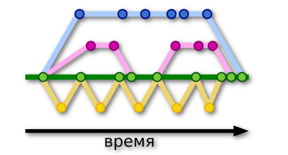
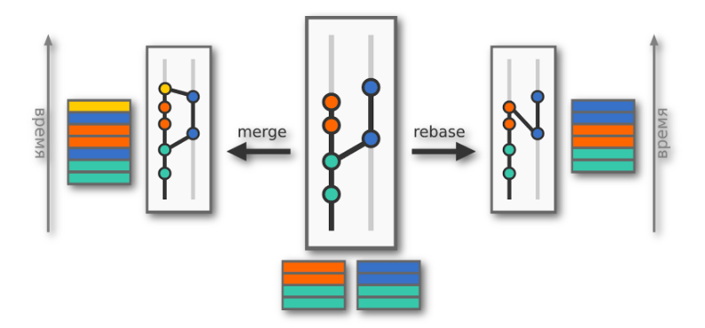

[< к содержанию](./readme.md)

## Ветвление в GIT

---
**Ветвление** - создание различных версий репозиториев, отличных друг от друга.

Главная концепция ветвления состоит в том, что вы можете отклоняться от основной линии разработки и продолжать работу независимо от неё, не вмешиваясь в основную линию.

Схематически это может выглядеть так:

**Кругами** изображены точки фиксации изменений в репозитории (коммиты).

**Зелёная ветка** - ветка программы, которая доступна пользователям.

---

**git branch [наименование]** - команда, которая создаёт новую ветку в репозитории.

**git checkout [наименование]** - команда, которая переключает вас на определённую ветку.

*Можно совместить выполнение этих команд:*

**git checkout -b [наименование]** - команда, которая создаёт ветку и переключает вас на неё.

### **Слияние веток (объединение)**

---
**git merge [наименование]** - поглощение. Вносит коммиты из другой ветки в текущую.

**git rebase [наименование]** - перебазирование. В этом случае коммиты вашей ветки накладываются поверх текущего состояния указанной ветки.

***В случае возникнования конфликта, требуется вручную написать результирующий код, а после этого зафиксирвать (закоммитить) изменения.***