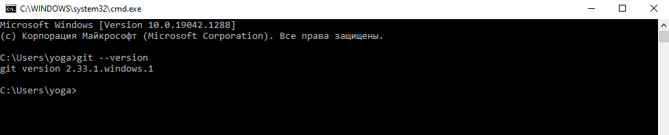

[< к содержанию](./readme.md)

## Установка GIT в WINDOWS

---
Проверка наличия *GIT*:
```
>git --version
```

Если *GIT* уже был установлен, вам отобразится его версия:



Для установки *GIT* перейдите [на страницу](https://git-scm.com/download/win), скачайте подходящий дистрибутив и следуйте инструкции.

Существует огромное количество способов установки *GIT*. Смотрите их в [официальной документации](https://git-scm.com/book/ru/v2/Введение-Установка-Git).