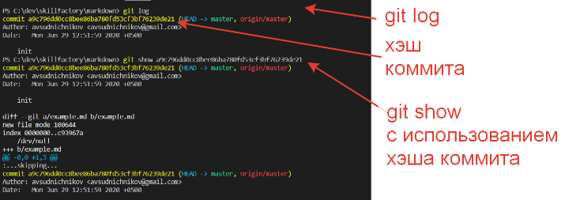

[< к содержанию](./readme.md)

## Работа с удалённым репозиторием
---

Удалённые репозитории это версии вашего *IT*-проекта, сохранённые в сети (локальной или интернет). При совместной работе над проектом предполагается внесение изменений в удалённый репозиторий.

**git remote add [имя_удалённого_репозитория] [адрес]** 
- используется для добавления связанных удалённых репозиториев.

**git fetch**
- используется для получения изменений с удалённого репозитория. При этом приходит список изменений, но они не вносятся в код, используемый в локальном репозитории.

**git merge**
- используется для слияния полученных изменений и локального репозитория.

**git pull**
- является объединением двух последовательных команд *git fetch* и *git merge*.

**git push**
- производит отправку ваших изменений в репозиторий. 

* если вы и другой разработчик одновременно клонируете, затем он выполняет команду *push*, то если после него вы попытаетесь выполнить команду *push*, ваш *push* точно будет отклюнён. Для внесения ваших изменений вам требуется получить изменения с удалённого репозитория и слить их с вашим программным кодом.

## Получение данных о состоянии репозитория
---

**git status**
- позволяет отследить состояние репозитория;
- позволяет узнать какие изменения необходимо зарегистрировать *GIT* (при необходимости - отменить).

**git log**
- покажет список последних коммитов и их хеши *SHA*1;
- список выводится начиная с последнего коммита.

**git show [хэш]**
- показывает информацию по определённому коммиту.

---
*Пример использования команд **git log** и **git show***